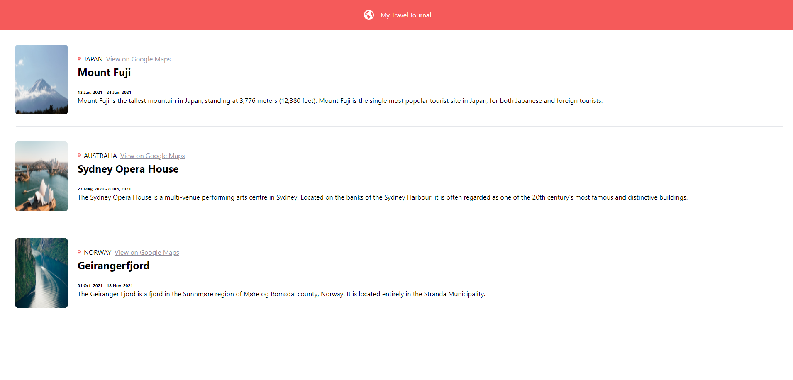
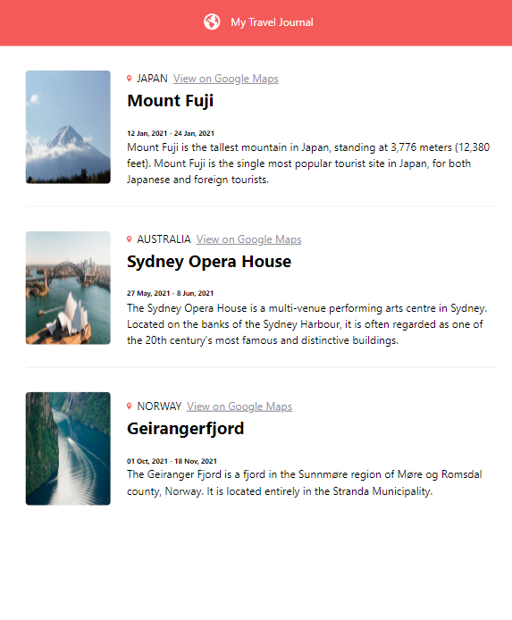

# Travel Journal


## Table of contents

- [Overview](#overview)
  - [Screenshots](#screenshots)
  - [Links](#links)
- [My process](#my-process)
  - [Built with](#built-with)
  - [What I learned](#what-i-learned)
  - [Continued development](#continued-development)

## Overview

This project is from Scrimba's Frontend Path course. It showcases a list of travel destinations and their descriptions.

**This is NOT a tutorial project.** I built this utilizing the skills I acquired from the course as well as my own knowledge. There is no official solution.

### Screenshots

##### Desktop View




##### Mobile View




### Links

- Solution URL: [Github Repo](https://github.com/DeviantSchemist/traveljournal)
- Live Site URL: [Live Site](https://starlit-chimera-ea5092.netlify.app/)

## My process

### Built with

- Semantic HTML5 markup
- React JS
- Vite
- Tailwind CSS
- Flexbox

### What I learned

I built this component using React and Tailwind CSS, using Vite as the bootstrap. This was mainly to solidfy my understanding of working with these two frameworks in tandem. Having the CSS be entirely within the HTML class names sped up development for me by only having to work within the component files and not having to open up a CSS file on the side.

I used semantic markup in each of the component files in order to get familiar with building sites with accessibility in mind.

Data is fetched from a Javascript file which is then loaded into the Card component.

**See below for the Card Component**:

```JSX
export default function Card ({ title, location, googleMapsUrl, startDate, endDate, description, imageUrl }) {
  return (
    <>
      <article className="flex gap-x-6 ml-[2.4375em] mt-[2.25em] mr-[2.5em] mb-[1.75em]">
        
        <section className="self-center">
          <section className="flex gap-x-2">
            
            <p>{location.toUpperCase()}</p>
            <p className="text-[#918E9B] underline"><a href={googleMapsUrl} target="_blank">View on Google Maps</a></p>
          </section>
          <h2 className="text-[1.5625rem] font-bold mb-6">{title}</h2>
          <p className="text-[0.64rem] font-bold">{`${startDate} - ${endDate}`}</p>
          <p>{description}</p>
        </section>
      </article>
      <hr className="text-[#F5F5F5] ml-[40px] mr-[32px] last:hidden" />
    </>
  )
}
```


### Continued development

I will be adding types to this project later as I study Typescript. I realize that not having types makes some of my code prone to errors.
